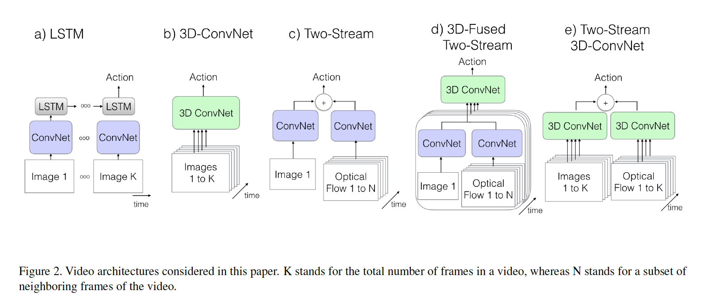
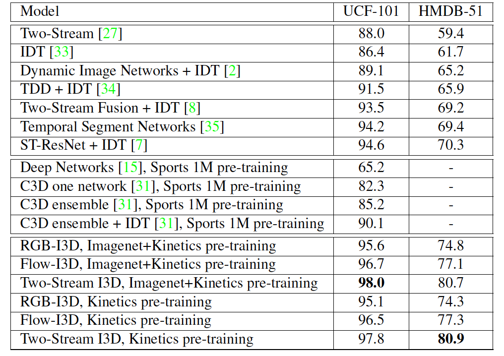
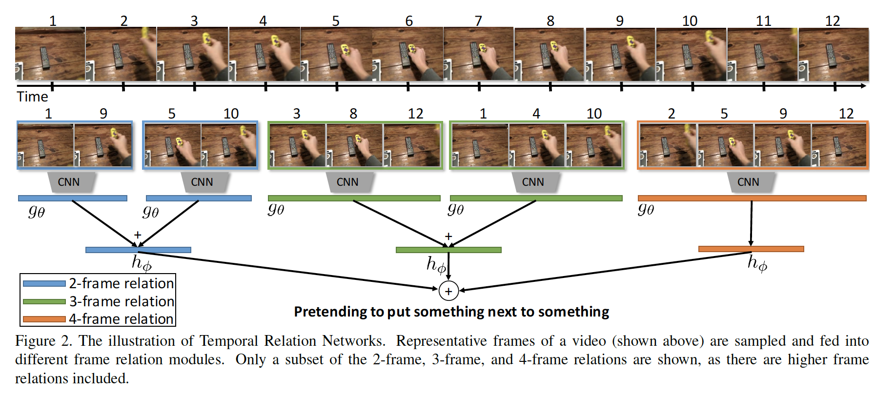
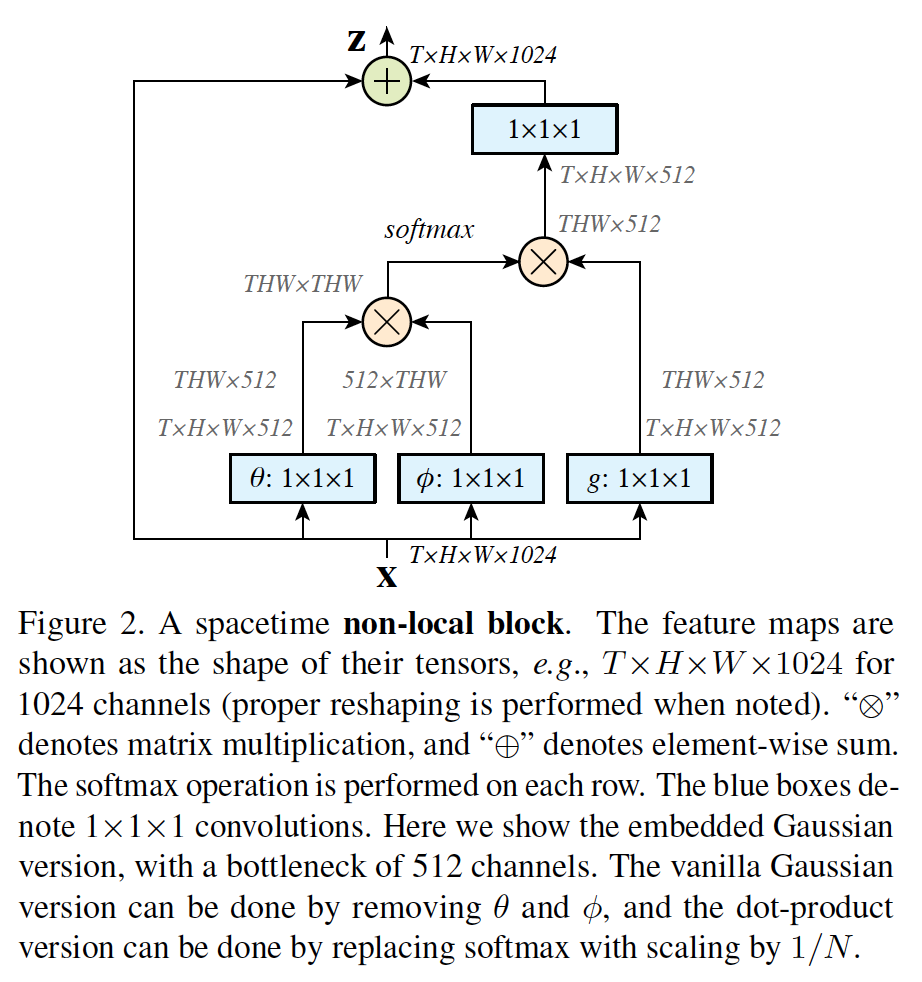

# Computer Vision - Video

## Video Classification/Action Recognition

**Video Classification** : videos can contain more than one activity, and typically large time lapses of the video are not related with any activity of interest.

**Action Recognition** : videos contain a single activity, and all the clips have a standard duration of ten seconds.

1. - [x] Limin Wang, Yuanjun Xiong, Zhe Wang, Yu Qiao, Dahua Lin, Xiaoou Tang, and Luc Van Gool. "**Temporal Segment Networks: Towards Good Practices for Deep Action Recognition**." ECCV 2016. [[pdf]](https://arxiv.org/abs/1608.00859)[[github]](https://github.com/yjxiong/temporal-segment-networks) (**TSN**)

1. - [x] Limin Wang, Wei Li, Wen Li, Luc Van Gool. "**Appearance-and-Relation Networks for Video Classification**." CVPR 2018. [[pdf]](https://arxiv.org/abs/1711.09125)[[github]](https://github.com/wanglimin/ARTNet) (**ARTNet**)
    
     + Introduction
     Video Classification的三种框架：
        * two-stream CNN 
        * 3D CNNs 
        * 2D CNNs + 时序模型如LSTM，时域卷积，稀疏采样和聚合，attention等
       
        

     Two-stream CNN 通过两个分支来捕获appearance和motion的信息，这对于video classification是比较有效的。但是它要训练两个网络比较费时，且需要提前提取optical flow也很耗时。
     
     3D CNNs利用3D conv和3D pooling直接从RGB的堆叠序列中学习到时空域的特征。但是3D CNN的效果还是比two-stream要稍差一些，这可能说明了：3D的结构可能并不能够有效地同时对表观信息和时序关系进行建模。
     
     2D CNNs + 时序模型 通常在提取粗糙的长时的时序结构上表现的比较好，对于提取短时的精细的时序关系表现得不太好。
     
     + Contribution
        * SMART block能够同时对appearance和relation建模；
        * ARTNet是通过堆叠多个SMART blocks得到的，可以从不同尺度对appearance和relation进行建模 ，这也使得SMART block的参数优化可以end-to-end地进行。
        * ARTNet在Kinetics上实验的结果表明，仅通过RGB的输入，train from scratch，能够达到state-of-the-art的性能。

     + Spatiotemporal Feature Learning
     
        

1. - [x] Brian Zhang, Joao Carreira, Viorica Patraucean and at al. "**Qua Vadis, Action Recognition? A New Model and the Kinetics Dataset**." CVPR 2017. [[pdf]](https://arxiv.org/abs/1705.077509)[[github]](https://github.com/deepmind/kinetics-i3d/) (**kinetics-i3d**)

     + Dataset

        Kinetics Human Action Video dataset(包含大量数据，有400个动作分类，每个分类有超过400个实例，来源于YouTube，更有挑战性

     + Action Classification Architectures      

        

        

        * ConvNet + LSTM
        * 3D ConvNet: 相比于2D，参数更多，也就更难训练（因为数据量不足）
        * Two-Stream: 将单独的一张RGB图片和一叠计算得到的光流帧分别送入在ImageNet上预训练的ConvNet中，再把两个通道的score取平均
        * 3D-Fused Two-Stream: 在最后一层卷积层之后，使用3D ConvNet把空间流和时间流融合
        * Two-Stream I3D: 区别于之前的几种双流，光流数是RGB帧数的2L倍，这里光流和RGB帧都使用了64帧

     + Experimental Comparison of Architectures

        

        

1. - [x] Bolei Zhou, Alex Andonian, Antonio Torralba. "**Temporal Relational Reasoning in Videos**." CVPR 2018. [[pdf]](https://arxiv.org/abs/1711.08496v1)[[github]](https://github.com/metalbubble/TRN-pytorch) (**TRN**)

     + Algorithm

        时间关系推理（Temporal relational reasoning）是指理解物体／实体在时间域的变化关系的能力。受启发于Relation Network，本文提出了TRN，用于学习和推理视频帧之间的时间依赖关系。

        

     + Dataset

       因为数据集的采集方式不同导致对temporal reasoning的效果有影响，所以使用Something-Something，Jester，Charades三个数据集上进行，不用UCF101和Kinetics。

       UCF101和Kinetics两个数据集是从Youtube上下载视频然后进行标注的。而Something-Something，Jester，Charades则是完全靠人工根据给定的动作类别来完成动作，所以有清楚的动作开始和结束的分界点，对于说明temporal relational reasoning的重要性有更加好的效果。

       

1. - [x] Xiaolong Wang, Ross Girshick, Abhinav Gupta, Kaiming He. "**Temporal Relational Reasoning in Videos**." CVPR 2018. [[pdf]](https://arxiv.org/abs/1711.07971v1)[[github]](https://github.com/facebookresearch/video-nonlocal-net) (**NonLocal**)

      + Contribution

        CNN中的 convolution单元每次只关注邻域 kernel size 的区域，就算后期感受野越来越大，终究还是局部区域的运算，这样就忽略了全局其他片区（比如很远的像素）对当前区域的贡献。所以 non-local blocks 要做的是，捕获这种 long-range 关系：对于2D图像，就是图像中任何像素对当前像素的关系权值；对于3D视频，就是所有帧中的所有像素，对当前帧的像素的关系权值。
        $$
        y_i=\frac{1}{C(x)}\sum_jf(x_i,x_j)g(x_j)
        $$

        * x为输入信号，可以是图片、序列或者视频，通常是它们的特征；

        * y为输出信号，与x相同尺寸；

        * i和j是位置的索引，它可以是空间、时间或者时空上的位置

        * f(a,b)函数用于计算a与b之间关系的相关程度

        * C(x)为归一化因子

        

        * 首先对输入的 feature map X 进行线性映射（说白了就是 1*1*1 卷积，来压缩通道数），然后得到特征 $ \theta$，$\phi$，g；
        * 通过reshape操作，强行合并上述的三个特征除通道数外的维度，然后对 $ \theta$ 和 $\phi$  进行矩阵点乘操作，得到类似协方差矩阵的东西（这个过程很重要，计算出特征中的自相关性，即得到每帧中每个像素对其他所有帧所有像素的关系）；
        * 然后对自相关特征 以列or以行（具体看矩阵 g 的形式而定） 进行 Softmax 操作，得到0~1的weights，这里就是我们需要的 Self-attention 系数；
        * 最后将 attention系数，对应乘回特征矩阵 g 中，然后再上扩 channel 数，与原输入 feature map X 残差一下，完整的 bottleneck

